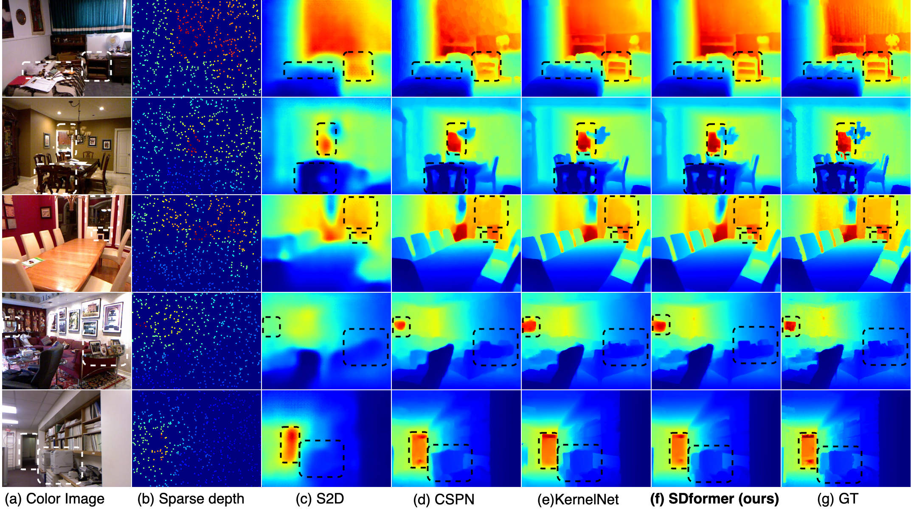
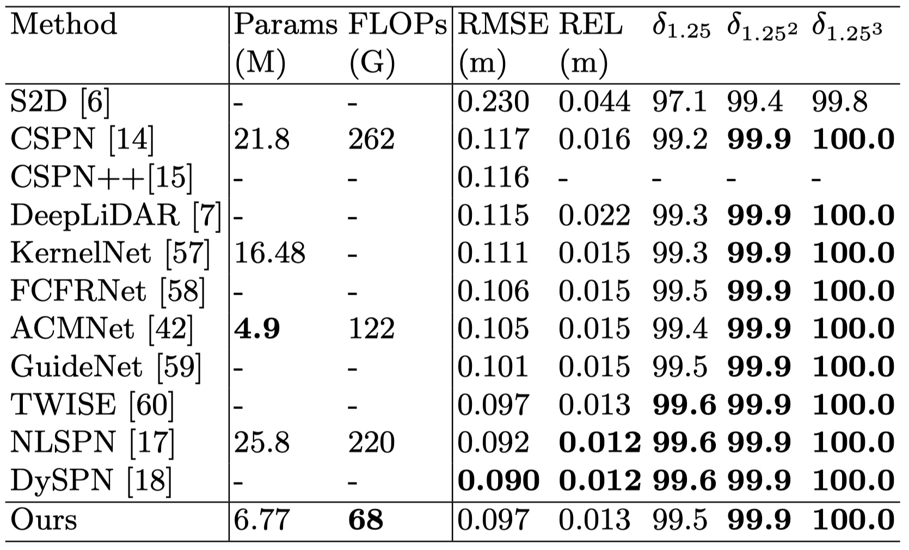
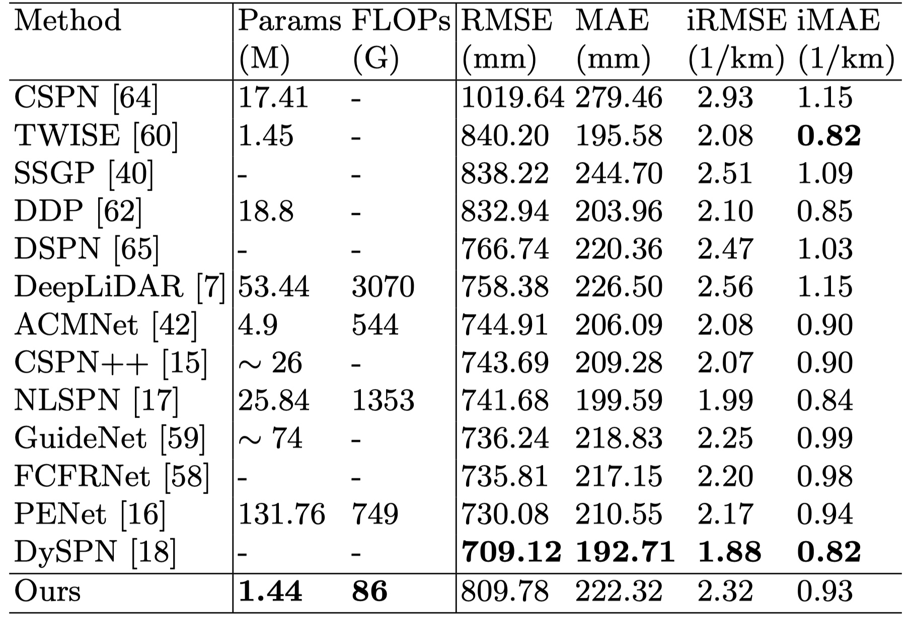

SDformer: Efficient End-to-End Transformer for Depth Completion
----------
### Introduction


In this work, we propose an efficient end-to-end Transformer based architecture for depth completion tasks named Sparse-to-Dense Transformer (SDformer). 
The network consists of an input module for the depth map and RGB image features extraction and concatenation, a U-shaped encoder-decoder Transformer for extracting deep features, and a refinement module. 
Specifically, we first concatenate the depth map features with the RGB image features through the input model.
Then, instead of calculating self-attention with the whole feature maps, we apply different window sizes to extract the long-range depth dependencies.
Finally, we refine the predicted features from the input module and the U-shaped encoder-decoder Transformer module to get the enriching depth features and employ a convolution layer to obtain the dense depth map.
In practice, the SDformer obtains state-of-the-art results against the CNN-based depth completion models with lower computing loads and parameters on the NYU Depth V2 and KITTI DC datasets.

### Results
Quanlitative Evaluation On NYU online test dataset



Quantitative Evaluation On NYU online test dataset



Quanlitative Evaluation On KITTI online test dataset


Quantitative Evaluation On KITTI online test dataset




### Enviroment Config
- pytorch=1.11 CUDA=11.6 python=3.9
- pip install einops tqdm matplotlib numpy opencv-python pandas scikit-image scikit-learn h5py
#### NVIDIA Apex

We used NVIDIA Apex for multi-GPU training.

Apex can be installed as follows:

```bash
$ cd PATH_TO_INSTALL
$ git clone https://github.com/NVIDIA/apex
$ cd apex
$ pip install -v --no-cache-dir ./ 
```

#### Dataset

We used NYU Depth V2 (indoor) and KITTI Depth Completion datasets for training and evaluation.

#### NYU Depth V2 

download NYU Depth Dataset 
```bash
$ cd PATH_TO_DOWNLOAD
$ wget http://datasets.lids.mit.edu/sparse-to-dense/data/nyudepthv2.tar.gz
$ tar -xvf nyudepthv2.tar.gz
```

#### KITTI Depth Completion (KITTI DC)

KITTI DC dataset get from the [KITTI DC Website](http://www.cvlibs.net/datasets/kitti/eval_depth.php?benchmark=depth_completion).

For KITTI Raw dataset is get from the [KITTI Raw Website](http://www.cvlibs.net/datasets/kitti/raw_data.php).

```bash
$ cd NLSPN_ROOT/utils
$ python prepare_KITTI_DC.py --path_root_dc PATH_TO_KITTI_DC --path_root_raw PATH_TO_KITTI_RAW
```
To get the train and test data, and the data structure as follows:

```
.
├── depth_selection
│    ├── test_depth_completion_anonymous
│    │    ├── image
│    │    ├── intrinsics
│    │    └── velodyne_raw
│    ├── test_depth_prediction_anonymous
│    │    ├── image
│    │    └── intrinsics
│    └── val_selection_cropped
│        ├── groundtruth_depth
│        ├── image
│        ├── intrinsics
│        └── velodyne_raw
├── train
│    ├── 2011_09_26_drive_0001_sync
│    │    ├── image_02
│    │    │     └── data
│    │    ├── image_03
│    │    │     └── data
│    │    ├── oxts
│    │    │     └── data
│    │    └── proj_depth
│    │        ├── groundtruth
│    │        └── velodyne_raw
│    └── ...
└── val
    ├── 2011_09_26_drive_0002_sync
    └── ...
```

#### Training

```bash
$ cd SDformer/src

# for NYU Depth v2 dataset training
$ python main.py --gpus 0,1  --epochs 25 --batch_size 8 --save NYU

# for KITTI Depth Completion dataset training
$ python main.py --gpus 0,1 --epochs 20 --batch_size 4 --test_crop --save KITTI
```

#### Testing

```bash
$ cd SDformer/src

$ python main.py --test_only --pretrain pretrain-path --save test_on_NYU

$ python main.py --test_only --pretrain pretrain-path --save test_on_KITTI
```

KITTI DC Online evaluation data:

```bash
$ cd SDformer/src
$ python main.py --split_json ../data_json/kitti_dc_test.json --test_only --pretrain pretrain --save_image --save_result_only --save online_kitti
```
